Welcome to fingeRNAt's README
===================

fingeRNAt is a software to calculate Structural Interaction Fingerprints in nucleic acids - ligands complexes.

[/badge.svg?branch=master)](https://github.com/n-szulc/fingeRNAt/actions?query=workflow%3A%22CI+%28conda%29%22)
[](https://www.python.org/downloads/release/python-360/)
[](https://www.gnu.org/licenses/gpl-3.0)
[](http://www.repostatus.org/#active)


<!-- TOC START min:1 max:6 link:true asterisk:false update:true -->
- [Overview](#overview)
	- [Why use Structural Interaction Fingerprints?](#why-use-structural-interaction-fingerprints)
- [Installation](#installation)
	- [Recommended method](#recommended-method)
	- [Manual installation](#manual-installation)
- [Usage](#usage)
	- [Quick start :zap:](#quick-start-zap)
	- [Parameters description](#parameters-description)
	- [Inputs](#inputs)
	- [Structural Interaction Fingerprints' (SIFs) types](#structural-interaction-fingerprints-sifs-types)
	- [User defined thresholds](#user-defined-thresholds)
	- [Outputs](#outputs)
		- [`FULL`](#full)
		- [`SIMPLE`](#simple)
		- [`PBS`](#pbs)
		- [`XP`](#xp)
	- [Wrappers](#wrappers)
	- [Visualization](#visualization)
	- [Usage examples](#usage-examples)
	- [Graphical User Interface](#graphical-user-interface)
	- [Debugging mode](#debugging-mode)
	- [Warnings/Errors](#warningserrors)
- [Frequently Asked Questions](#frequently-asked-questions)
- [fingerDISt :straight_ruler:](#fingerdist-straight_ruler)
	- [Installation](#installation-1)
	- [Usage](#usage-1)
		- [Quick start :zap:](#quick-start-zap-1)
		- [Parameters description](#parameters-description-1)
		- [Inputs](#inputs-1)
		- [Distance Metrics](#distance-metrics)
		- [Outputs](#outputs-1)
		- [Usage examples](#usage-examples-1)
- [Documentation](#documentation)
- [Unit test](#unit-test)
- [Detection of interactions](#detection-of-interactions)
	- [Nucleic acid properties](#nucleic-acid-properties)
	- [Ligand properties](#ligand-properties)
	- [Molecular Interactions' Geometric Rules](#molecular-interactions-geometric-rules)
		- [1. Hydrogen Bonds](#1-hydrogen-bonds)
		- [2. Halogen Bonds](#2-halogen-bonds)
		- [3. Cation - Anion](#3-cation---anion)
		- [4. Pi - Cation and 5. Pi - Anion](#4-pi---cation-and-5-pi---anion)
		- [6. Pi - Stacking](#6-pi---stacking)
- [Contributors](#contributors)
- [Feedback](#feedback)
- [Acknowledgments](#acknowledgments)
- [How to cite](#how-to-cite)
- [License](#license)
<!-- TOC END -->


# Overview

fingeRNAt is a Python 3.8 script calculating Structural Interaction Fingerprints (SIFs) in complexes of:

| Nucleic acid |Ligand|
|:---:|:---:|
| RNA | small molecule ligand |
| RNA | RNA  |
| RNA | DNA  |
| RNA | LNA  |
| RNA | protein |
| DNA | small molecule ligand |
| DNA | DNA  |
| DNA | RNA  |
| DNA | LNA  |
| DNA | protein |


fingeRNAt calculates different non-covalent interactions between input RNA/DNA structure and ligand and returns long binary string describing if particular interaction occurred between given nucleic acid residue and ligand or not.

fingeRNAt runs under Python 3.5 - 3.8 on Linux, Mac OS and Windows.

## Why use Structural Interaction Fingerprints?

Structural Interaction Fingerprints (SIFs) translate information about 3D interactions in a target-ligand complex into a string, where the respective bit in the fingerprint is e.g. set to 1 in case of detecting particular interaction, and to 0 otherwise. 

By using (SIFs), **the interactions are represented in a unified fashion, thus allowing for easy computational analysis and comparison**, as they provide a full picture of all interactions within the complex. 

# Installation

Recommended fingeRNAt usage is in conda environment.

## Recommended method

1. Install conda

  Please refer to [conda manual](https://docs.conda.io/projects/conda/en/latest/user-guide/install/index.html) and install conda version according to your operating system. Please use Python3 version.


2. Download fingeRNAt repository

      Manually - click on the green field `Clone or download`, then `Download ZIP`

      **or**

      Clone it into the desired location [requires [git](https://git-scm.com/downloads) installation] `git clone --depth=1 https://github.com/n-szulc/fingernat.git`

3. Restore conda environment

      `conda env create -f fingeRNAt/env/fingeRNAt_env.yml`


## Manual installation

Required dependencies are:

- Python 3.8
- openbabel 3.1.1
- numpy  
- pandas
- matplotlib
- rdkit
- tk
- sphinx

# Usage

## Quick start :zap:

To call fingeRNAt with example inputs:

```bash
conda activate fingernat

cd fingeRNAt

python code/fingeRNAt.py -r example_inputs/1aju_model1.pdb -l example_inputs/ligands.sdf -f SIMPLE
```

## Parameters description

fingeRNAt accepts the following parameters:

`-r` &nbsp;&nbsp;&nbsp;&nbsp;&nbsp;&nbsp;&nbsp;&nbsp;&nbsp;&nbsp;&nbsp;&nbsp;&nbsp;&nbsp;&nbsp;&nbsp;&nbsp;&nbsp;&nbsp;&nbsp; path to RNA/DNA structure; see -> [Inputs](#Inputs)

`-l` &nbsp;&nbsp;&nbsp;&nbsp;&nbsp;&nbsp;&nbsp;&nbsp;&nbsp;&nbsp;&nbsp;&nbsp;&nbsp;&nbsp;&nbsp;&nbsp;&nbsp;&nbsp;&nbsp;&nbsp; path to ligands file; see -> [Inputs](#Inputs)

`[-f]` &nbsp;&nbsp;&nbsp;&nbsp;&nbsp;&nbsp;&nbsp;&nbsp;&nbsp;&nbsp;&nbsp;&nbsp;&nbsp;&nbsp;&nbsp;&nbsp; optional Structural Interactions Fingerprint (SIFt) type;

 &nbsp;&nbsp;&nbsp;&nbsp;&nbsp;&nbsp;&nbsp;&nbsp;&nbsp;&nbsp;&nbsp;&nbsp;&nbsp;&nbsp;&nbsp;&nbsp;&nbsp;&nbsp;&nbsp;&nbsp;&nbsp;&nbsp;&nbsp;&nbsp;&nbsp;&nbsp;&nbsp;&nbsp;   available types are: `FULL` [default], &nbsp;&nbsp;`SIMPLE`, &nbsp;&nbsp;`PBS`, &nbsp;&nbsp;`XP`

  &nbsp;&nbsp;&nbsp;&nbsp;&nbsp;&nbsp;&nbsp;&nbsp;&nbsp;&nbsp;&nbsp;&nbsp;&nbsp;&nbsp;&nbsp;&nbsp;&nbsp;&nbsp;&nbsp;&nbsp;&nbsp;&nbsp;&nbsp;&nbsp;&nbsp;&nbsp;&nbsp;&nbsp; see -> [SIFs types](#structural-interaction-fingerprints-sifs-types)

`[-o]` &nbsp;&nbsp;&nbsp;&nbsp;&nbsp;&nbsp;&nbsp;&nbsp;&nbsp;&nbsp;&nbsp;&nbsp;&nbsp;&nbsp;&nbsp;&nbsp; optional path to save output

`[-dha]`&nbsp;&nbsp;&nbsp;&nbsp;&nbsp;&nbsp;&nbsp;&nbsp;&nbsp;&nbsp;&nbsp;&nbsp;&nbsp; optional Donor-Hydrogen-Acceptor angle calculation when detecting hydrogen bonds;

  &nbsp;&nbsp;&nbsp;&nbsp;&nbsp;&nbsp;&nbsp;&nbsp;&nbsp;&nbsp;&nbsp;&nbsp;&nbsp;&nbsp;&nbsp;&nbsp;&nbsp;&nbsp;&nbsp;&nbsp;&nbsp;&nbsp;&nbsp;&nbsp;&nbsp;&nbsp;&nbsp;&nbsp;
see -> [1. Hydrogen Bonds](#1-hydrogen-bonds)

`[-print]`&nbsp;&nbsp;&nbsp;&nbsp;&nbsp;&nbsp;&nbsp;&nbsp;&nbsp; print detected interactions for each nucleic acid - ligand complex on screen


`[-vis]`&nbsp;&nbsp;&nbsp;&nbsp;&nbsp;&nbsp;&nbsp;&nbsp;&nbsp;&nbsp;&nbsp;&nbsp;&nbsp; optional SIFs results heatmap visualization; see -> [Visualization](#Heatmap-visualization)

`[-wrapper]` &nbsp;&nbsp;&nbsp;&nbsp; optional SIFs results wrapper, see -> [Wrappers](#Wrappers)


 &nbsp;&nbsp;&nbsp;&nbsp;&nbsp;&nbsp;&nbsp;&nbsp;&nbsp;&nbsp;&nbsp;&nbsp;&nbsp;&nbsp;&nbsp;&nbsp;&nbsp;&nbsp;&nbsp;&nbsp;&nbsp;&nbsp;&nbsp;&nbsp;&nbsp;&nbsp;&nbsp;&nbsp;   available types are: `ACUG`, &nbsp;&nbsp;`PuPy`, &nbsp;&nbsp;`Counter`

 `[-verbose]` &nbsp;&nbsp;&nbsp;&nbsp; provides additional information about performed calculations at the given moment

 `[-debug]` &nbsp;&nbsp;&nbsp;&nbsp;&nbsp;&nbsp;&nbsp;&nbsp; enters debug mode, see -> [Debbuging mode](#debugging-mode)

 `[-h]` &nbsp;&nbsp;&nbsp;&nbsp;&nbsp;&nbsp;&nbsp;&nbsp;&nbsp;&nbsp;&nbsp;&nbsp;&nbsp;&nbsp;&nbsp;&nbsp; show help message

## Inputs

1. `-r `: path to receptor - DNA/RNA structure
    - supported file types: pdb, mol2
    - **only 1 model** of DNA/RNA structure
         - if there are more models, you have to choose only one (e.g. manually delete remaining models)
    - **only** DNA/RNA chains
        - no water, ions, ligands

		**Hydrogens need to be added**


<br />

2. `-l`: path to ligand - small molecule, DNA/RNA/LNA or protein structure
	- **small molecule ligands**
         - supported file types: sdf
         - possible multiple poses of ligands in one file
    - **RNA/DNA structure**
    	- supported file types: sdf
    	- possible multiple models of DNA/RNA structure
    	- **only** DNA/RNA chains
        	- no water, ions, ligands


**Notes:**
- Input ligand molecules should have assigned desired protonation state and formal charges.
- In the receptor molecule, charges on the phosphate groups do not need to be assigned (fingeRNAt always treats OP1 and OP2 atoms as negatively charged anions).
- Please pay attention to sdf ligand files converted from pdbqt/mol2 files, if the *formal charges* are preserved in the sdf files.
-	All the missing ligands' hydrogens will be automatically added.


## Structural Interaction Fingerprints' (SIFs) types

*Structural Interaction Fingerprint (SIFt)* is a binary string, describing existence (1/0) of specified molecular interactions between all target's residues and ligand (*Deng et al.*, 2004).

<p align="center">

</p>

<br/>
<br/>

<p align="center">

</p>

Example of SIFt calculated for six non-covalent interactions between HIV-2 Trans-activation response element (TAR) structure (PDB ID: 1AJU) and imatinib.

<br/>


**Available SIFs types `[-f]`**

- `FULL`

    Calculates **six non-covalent interactions** for each DNA/RNA residue - ligand  pair: hydrogen bondings (HB), halogen bondings (HAL), cation - anion (CA), Pi - cation (Pi\_Cation), Pi - anion (Pi\_anion) & Pi - stacking (Pi\_Stacking) interactions; returns six 0/1 values for each residue.

- `SIMPLE`

    **Calculates distances** between each DNA/RNA residue and ligand; returns 1 if the distance is less than declared threshold (default = 4.0 &#8491;), 0 otherwise. Does not take into account distances between hydrogens or hydrogen - heavy atom.

- `PBS`

    Divides each DNA/RNA residue in **3 groups: Phosphate, Base, Sugar** and for each group **calculates distance** to the ligand; returns three 0/1 values for each group within residue - 1 if the distance is less than declared threshold (default = 4.0 &#8491;), 0 otherwise. Does not take into account distances between hydrogens or hydrogen - heavy atom.

    > **_NOTE:_** Only for DNA/RNA with canonical residues.

- `XP`

    Calculates the same six non-covalent interactions for each DNA/RNA residue as `FULL`, however it is of no binary type - it **calculates total number of each potential interactions occurrence** (exception: Pi - interactions) for each RNA/DNA  - ligand pair, therefore being an **extra precision hologram**.

    > **_NOTE 1:_** It returns **total number of potential interactions** between given residue and ligand pair, e.g. if the residue has one hydrogen bond acceptor and the ligand has two hydrogen bond donors (both fulfilling hydrogen bonds geometrical rules), XP will return `2`, despite the fact that one hydrogen bond donor may interact with only one hydrogen bond acceptor. The same rule applies to halogen bonds and cation-anion interactions.

    <p align="center">
    
    </p>

    Residue 22 from 1AJU (magenta) and ligand (cyan). `XP` will return 5 potential hydrogen bonds for this residue-ligand pair.

    > **_NOTE 2:_** **It does not calculate total number of potential Pi - interactions** as  both purine's rings are considered separately. If total numbers of Pi - interactions were calculated, interaction between purine and ligand's aromatic ring would be calculated as two independent interactions, which would not be true.

    In case of hydrogen bonds, `XP` not only calculates total number of their potential occurrence in each DNA/RNA - ligand pair, but **also assigns each hydrogen bond to strong/moderate/weak type** and calculates total number of each of them.


## User defined thresholds

All the default thresholds can be changed in `code/config.py`

## Outputs

Calculated SIFs are saved to tsv files. This is a simple text format similar to csv, except for the data being tab-separated instead of comma-separated (as in csv).

If fingeRNAT was run without optional parameter `-o`, script will create `outputs/` directory in the working directory and save there the output in tsv format. Otherwise fingeRNAt will save outputs in the user-specified location.

Example outputs for four SIFs types and their three wrappers are available from `fingeRNAt/example_outputs`.

### `FULL`

<p align="center">
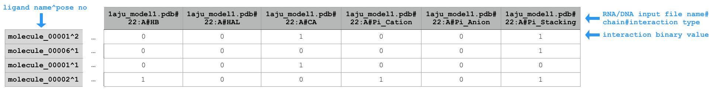
</p>

Sample extract of output of running `python code/fingeRNAt.py -r example_inputs/1aju_model1.pdb -l example_inputs/ligands.sdf`

<br/>


### `SIMPLE`

<p align="center">

</p>

Sample extract of output of running `python code/fingeRNAt.py -r example_inputs/1aju_model1.pdb -l example_inputs/ligands.sdf -f SIMPLE`


<br/>

### `PBS`

<p align="center">
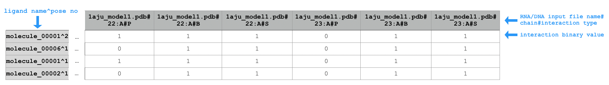
</p>

Sample extract of output of running `python code/fingeRNAt.py -r example_inputs/1aju_model1.pdb -l example_inputs/ligands.sdf -f PBS`

<br/>

### `XP`

<p align="center">
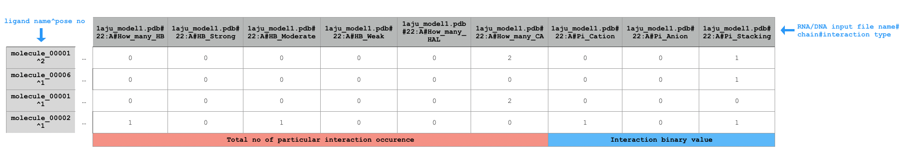
</p>

Sample extract of output of running `python code/fingeRNAt.py -r example_inputs/1aju_model1.pdb -l example_inputs/ligands.sdf -f XP`


## Wrappers

Calculated SIFs of all four types can be wrapped, representing them in decreasing resolutions. Multiple wrappers may be passed at once (comma-separated; see -> ['Usage examples'](#usage-examples)). The results for the SIFs calculations and all passed wrappers are saved to separate tsv files.

There are 3 types of wrappers:

- `ACUG`

	Wraps calculated results according to nucleotide, gives information if particular kind of interaction between e.g. any adenine from DNA/RNA and ligand occurred (for SIFt types: `SIMPLE`, `PBS`, `FULL`) or returns number of possible interactions with all adenines (for SIFt type `XP`; see -> [`XP`](#xp)).

	<p align="center">
	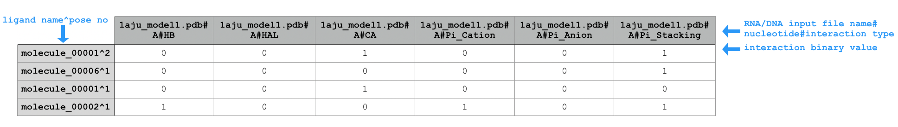
	</p>

	Sample extract of output of running `python code/fingeRNAt.py -r example_inputs/1aju_model1.pdb -l example_inputs/ligands.sdf -wrapper ACUG`

	<br/>

	<p align="center">
	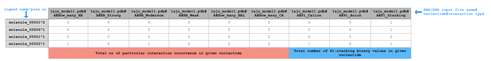
	</p>

	Sample extract of output of running `python code/fingeRNAt.py -r example_inputs/1aju_model1.pdb -l example_inputs/ligands.sdf -f XP -wrapper ACUG`

- `PuPy`

	Wraps calculated results according to nucleobase type (purine or pyrimidyne), gives information if particular kind of interaction between e.g. any purine from DNA/RNA and ligand occurred (for SIFt types: `SIMPLE`, `PBS`, `FULL`) or returns number of possible interactions with all purines (for SIFt type `XP`; see -> [`XP`](#xp)).

	<p align="center">
	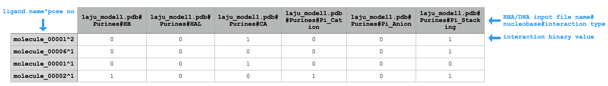
	</p>

	Sample extract of output of running `python code/fingeRNAt.py -r example_inputs/1aju_model1.pdb -l example_inputs/ligands.sdf -wrapper PuPy`

	<br/>

	<p align="center">
	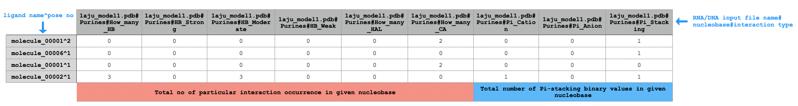
	</p>

	Sample extract of output of running `python code/fingeRNAt.py -r example_inputs/1aju_model1.pdb -l example_inputs/ligands.sdf -f XP -wrapper PuPy`

- `Counter`

	Counts total number of given interaction type for any SIFt type. Sums all binary interactions (for SIFt types: `SIMPLE`, `PBS`, `FULL`) or calculates total number of possible interactions (for SIFt type `XP`; see -> [`XP`](#xp)).

	<p align="center">
	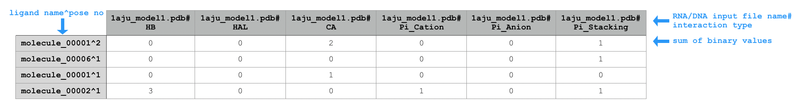
	</p>

	Sample extract of output of running `python code/fingeRNAt.py -r example_inputs/1aju_model1.pdb -l example_inputs/ligands.sdf -wrapper Counter`

	<br/>

	<p align="center">
	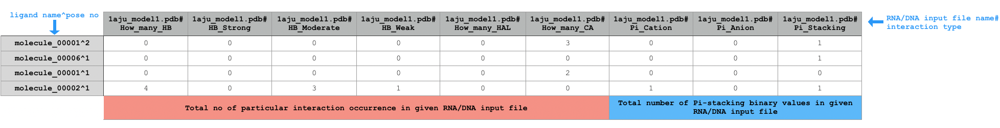
	</p>

	Sample extract of output of running `python code/fingeRNAt.py -r example_inputs/1aju_model1.pdb -l example_inputs/ligands.sdf -f XP -wrapper Counter`

## Visualization

All SIFs outputs can be visualized as heatmap and saved as png files with the same name as tsv output.

<p align="center">
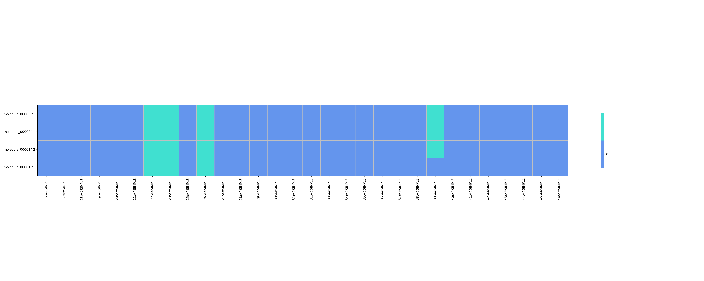
</p>

Heatmap for SIFt type `SIMPLE` obtained from running `python code/fingeRNAt.py -r example_inputs/1aju_model1.pdb -l example_inputs/ligands.sdf -f SIMPLE -vis`

<br/>

<p align="center">
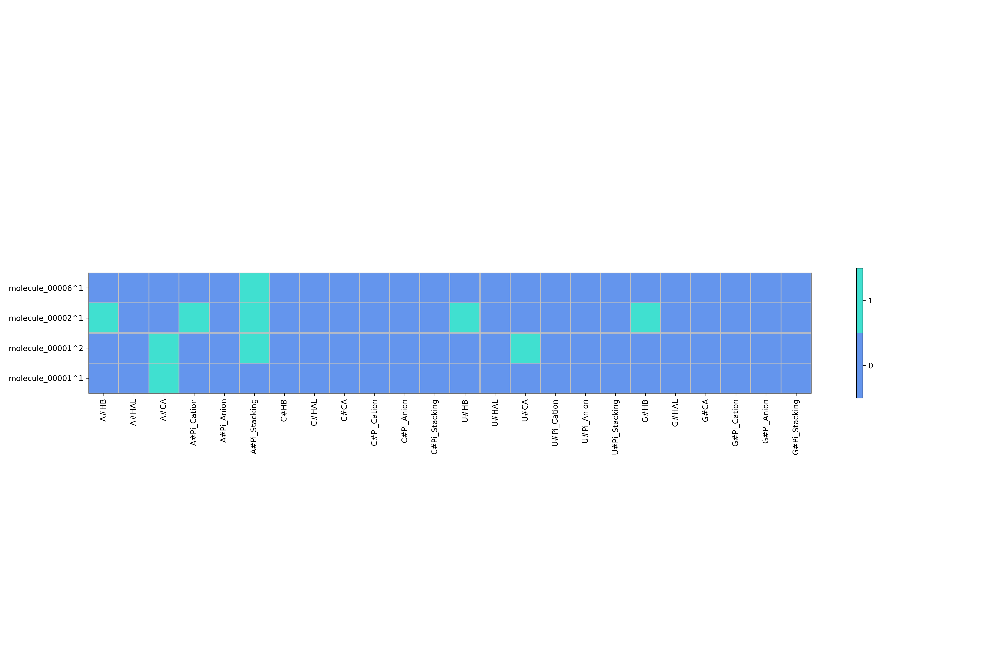
</p>

Heatmap for SIFt type `FULL` with wrapper `ACUG` obtained from running `python code/fingeRNAt.py -r example_inputs/1aju_model1.pdb -l example_inputs/ligands.sdf -vis -wrapper ACUG`

<br/>

<p align="center">

</p>

Heatmap for SIFt type `XP` with wrapper `PuPy` obtained from running `python code/fingeRNAt.py -r example_inputs/1aju_model1.pdb -l example_inputs/ligands.sdf -f XP -vis -wrapper PuPy`

<br/>

<p align="center">
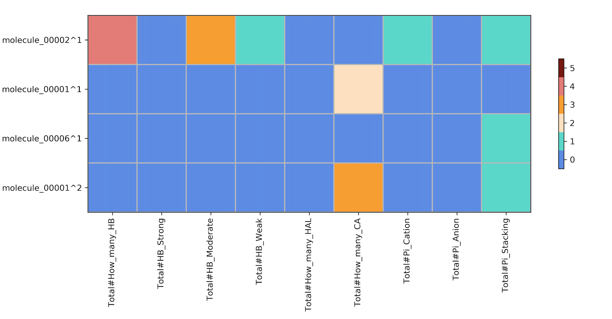
</p>

Heatmap for SIFt type `XP` with wrapper `Counter` obtained from running `python code/fingeRNAt.py -r example_inputs/1aju_model1.pdb -l example_inputs/ligands.sdf -f XP -vis -wrapper Counter`

## Usage examples

- Calculate SIFt `FULL`, print detected interactions on screen and save the output in the default location with the default filename.

`python code/fingeRNAt.py -r example_inputs/1aju_model1.pdb -l example_inputs/ligands.sdf -print`

- Calculate SIFt `SIMPLE` and save the output in the user-declared location with the default filename.

`python code/fingeRNAt.py -r example_inputs/1aju_model1.pdb -l example_inputs/ligands.sdf -f SIMPLE -o /path/to/my_output/`

- Calculate SIFt `PBS`, see what is being calculated using verbose mode, and save the output with the default filename in the `outputs` directory together with heatmap.

`python code/fingeRNAt.py -r example_inputs/1aju_model1.pdb -l example_inputs/ligands.sdf -f PBS -verbose -vis`

- Calculate default SIFt `FULL` and save it's output and three wrapped outputs with the default filenames in the in the `outputs` directory.

`python code/fingeRNAt.py -r example_inputs/1aju_model1.pdb -l example_inputs/ligands.sdf -wrapper ACUG,PuPy,Counter`

- Calculate SIFt `XP` considering Donor-Hydrogen-Acceptor angle calculation (when detecting hydrogen bonds) and save the output, one wrapped output and two heatmaps in the user-declared location with the desired filename.

`python code/fingeRNAt.py -r example_inputs/1aju_model1.pdb -l example_inputs/ligands.sdf -f XP -dha -o /path/to/my_output/my_filename -vis -wrapper ACUG`

## Graphical User Interface

To use Graphical User Interface (GUI), simply run

`python code/gui.py`

GUI is user-friendly and has all aforementioned functionalities.

<p align="center">

</p>

## Debugging mode

fingeRNAt has debugging mode in which it prints on screen exhaustive information about detected interactions.

Debugging mode may be used with each of four SIFt types and provides the following information:

- `FULL` & `XP`

     1. prints the following properties of each ligand:
		* atom indices of hydrogen bonds acceptors & donors
		* atom indices of halogen bonds donors
		* atom indices of cations & anions
		* atom indices of aromatic rings

     2. prints the following properties for each residue of nucleic acid:
		* atom IDs of hydrogen bonds acceptors & donors
		* atom IDs of anions
		* atom IDs of aromatic rings

     3. prints detected interactions for pair of each nucleic acid residue - ligand:
		* atoms creating hydrogen bond with their distance and angle (if flag `-dha` was used), separately for cases when nucleic acid is hydrogen bond acceptor and hydrogen bond donor
		* atoms creating halogen bond with their distance and angles
		* atoms creating cation-anion interaction with their distance (note that nucleic acid's atoms are anions)
		* atoms creating Pi-cation interaction with their distance and angle
		* atoms creating Pi-anion interaction with their distance and angle (note that ligand's atoms are anions)
		* atoms creating Pi-stacking interaction type Sandwich/Displaced with their distance, offset and angle
		* atoms creating Pi-stacking interaction type T-shaped with their distance, offset and angle


     > **_NOTE:_** If run with SIFt type `FULL`, it prints only the first detected interaction of given type between nucleic acid's residue - ligand , as `FULL` stops searching for more  once it detected one such interaction. Therefore we recommend to run debugging mode with SIFt type `XP` to see **all** interactions between given nucleic acid's residue - ligand.


     **Usage example**

     `python code/fingeRNAt.py -r example_inputs/1aju_model1.pdb -l example_inputs/ligands.sdf -f XP -debug`


- `SIMPLE`

    for each detected contact of nucleic acid residue - ligand prints information about atoms IDs and the distance between them

    e.g.

    ```
    ### 1aju_model1.pdb - molecule_00001^2 first below cutoff dist: 3.5578 ###
	    between	A:22:P	 7 atom molecule_00001^2
    ```

    > **_NOTE:_** It prints only the first detected pair of atoms in contact, as `SIMPLE` stops searching for more contacts of particular nucleic acid's residue - ligand once it detected one contact.

     **Usage example**

    `python code/fingeRNAt.py -r example_inputs/1aju_model1.pdb -l example_inputs/ligands.sdf -f SIMPLE -debug`

- `PBS`

    for each detected contact of nucleic acid residue's group - ligand prints information about atoms IDs and the distance between them

    e.g.

    ```
    ### 1aju_model1.pdb - molecule_00001^2 first below cutoff PHOSPHATE GROUP dist: 3.5578 ###
        between	A:22:P	 7 atom molecule_00001^2
    ### 1aju_model1.pdb - molecule_00001^2 first below cutoff SUGAR GROUP dist: 3.7453 ###
        between	A:22:O5'	 1 atom molecule_00001^2
    ```

    > **_NOTE:_** It prints only the first detected pair of atoms in contact, as `PBS` stops searching for more contacts of particular nucleic acid's residue's group - ligand once it detected one contact.

     **Usage example**

    `python code/fingeRNAt.py -r example_inputs/1aju_model1.pdb -l example_inputs/ligands.sdf -f PBS -debug`

## Warnings/Errors

Please pay attention to the following types of errors: **Could not sanitize molecule ending on line ...**. This means that RDKit library used by the fingeRNAt can not properly reat the molecule.

An example:

```
[08:46:45] non-ring atom 39 marked aromatic
[08:46:45] ERROR: Could not sanitize molecule ending on line 168
[08:46:45] ERROR: non-ring atom 39 marked aromatic
```

- Error: **non-ring atom ... marked aromatic**
  - Solution: please make sure that the mentioned molecule has a proper aromatic ring representation.
- Error: **Explicit valence for atom # ..., is greater than permitted** (eg., *Explicit valence for atom # 18 O, 3, is greater than permitted*)
  - Solution: please make sure that the indicated atom(s) have a proper valence number, i.e., they form a correct number of bonds.

# Frequently Asked Questions

**What happens when I have a non-canonical nucleotide in my nucleic acid?**

* If you have a residue with **only** non-canonical name (all atom names are canonical), e.g. X

|   | `FULL`  | `SIMPLE`  | `PBS`  | `XP`  |
|:-:|:-:|:-:|:-:|:-:|
| No wrapper  |  OK |  OK  | OK   |  OK  |
| `ACUG`  | Omits interaction for residue with non-canonical name  | Omits interaction for residue with non-canonical name  |  Omits interaction for residue with non-canonical name |  Omits interaction for residue with non-canonical name |
|  `PuPy` |  Omits interaction for residue with non-canonical name | Omits interaction for residue with non-canonical name  |  Omits interaction for residue with non-canonical name |  Omits interaction for residue with non-canonical name |
| `Counter`  |  OK |  OK | OK  |  OK |

* If you have a residue with canonical name but with non-canonical atom name e.g. P9

|   | `FULL`  | `SIMPLE`  | `PBS`  | `XP`  |
|:-:|:-:|:-:|:-:|:-:|
| No wrapper  |  OK |  OK  | Does not work   |  OK  |
| `ACUG`  |  OK   | OK  |  Does not work|   OK  |
|  `PuPy` |   OK  | OK |  Does not work|   OK  |
| `Counter`  |  OK |  OK | Does not work  |  OK |

Please note we consider both oxygens from phosphate group (OP1 and OP2) of nucleic acid as negatively charged, therefore fingeRNAt will not consider differently named atoms as anions.

* If you have a residue with non-canonical name and non-canonical atom name e.g. P9

|   | `FULL`  | `SIMPLE`  | `PBS`  | `XP`  |
|:-:|:-:|:-:|:-:|:-:|
| No wrapper  |  OK |  OK  | Does not work   |  OK  |
| `ACUG`  |  Omits interaction for residue with non-canonical name | Omits interaction for residue with non-canonical name  |  Does not work |  Omits interaction for residue with non-canonical name |
|  `PuPy` | Omits interaction for residue with non-canonical name  | Omits interaction for residue with non-canonical name  |  Does not work |  Omits interaction for residue with non-canonical name |
| `Counter`  |  OK |  OK | Does not work |  OK |

Please note  we consider both oxygens from phosphate group (OP1 and OP2) of nucleic acid as negatively charged, therefore fingeRNAt will not consider differently named atoms as anions.

---

**What happens when I have nucleic acid with two residues with the same number e.g. due to errors in structure?**

In case of SIFt types `SIMPLE` and `PBS`, the only difference is that their outputs will have two columns with the same name in output, SIFs will be OK. It will have no influence on their wrapped results though.

However in case of SIFt types `FULL` and `XP`, there will be two columns with the same name but their Pi-interactions may be swapped and their SIFs together with wrapped results may be unreliable.


# fingerDISt :straight_ruler:


fingerDISt is an additional, standalone tool which calculates different Distance Metrics based on Structural Interaction Fingerprints (SIFs) - outputs of fingeRNAt.

It calculates the selected Distance Metric for all SIFs vs. all SIFs from input file - creates a matrix of scores and saves it to tsv file.

## Installation

fingerDISt, similarly like fingeRNAt, requires Python 3.5 - 3.8, and may be run from within fingeRNAt's environment, but it is not obligatory. No external modules are needed.

## Usage

### Quick start :zap:

```bash

cd fingeRNAt

python code/fingerDISt.py -i example_outputs/FULL/1aju_model1.pdb_ligands.sdf_FULL.tsv -m tanimoto
```

### Parameters description

fingerDISt accepts the following parameters:

`-i` &nbsp;&nbsp;&nbsp;&nbsp;&nbsp;&nbsp;&nbsp;&nbsp;&nbsp;&nbsp;&nbsp;&nbsp;&nbsp;&nbsp;&nbsp;&nbsp;&nbsp;&nbsp;&nbsp;&nbsp; path to tsv/csv file with calculated SIFs; see -> [Inputs](#Inputs-1)

`-m` &nbsp;&nbsp;&nbsp;&nbsp;&nbsp;&nbsp;&nbsp;&nbsp;&nbsp;&nbsp;&nbsp;&nbsp;&nbsp;&nbsp;&nbsp;&nbsp;&nbsp;&nbsp;&nbsp;&nbsp; types of desired Distance Metrics; see -> [Distance Metrics](#distance-metrics)

`[-o]` &nbsp;&nbsp;&nbsp;&nbsp;&nbsp;&nbsp;&nbsp;&nbsp;&nbsp;&nbsp;&nbsp;&nbsp;&nbsp;&nbsp;&nbsp;&nbsp; optional path to save output

`[-verbose]` &nbsp;&nbsp;&nbsp;&nbsp; prints calculated Distance Metrics on the screen

`[-h]` &nbsp;&nbsp;&nbsp;&nbsp;&nbsp;&nbsp;&nbsp;&nbsp;&nbsp;&nbsp;&nbsp;&nbsp;&nbsp;&nbsp;&nbsp;&nbsp; show help message

### Inputs

1. `-i `: path to tsv/csv file with calculated SIFs

		**fingeRNAt outputs are fingerDISt inputs**

		Example inputs may be found in `fingeRNAt/tests/expected_outputs`.

### Distance Metrics

fingerDISt calculates the following Distance Metrics:

* Tanimoto coefficient
* Cosine similarity
* Manhattan
* Euclidean
* Square Euclidean
* Half Square Euclidean

The abovementioned Distance Metrics calculations were implemented based on code [github.com/varun-parthasarathy/crux-fr-sprint/blob/master/DistanceMetrics.py](github.com/varun-parthasarathy/crux-fr-sprint/blob/master/DistanceMetrics.py) under MIT license.

  > **_NOTE:_** **Tanimoto coefficient works only for SIFs with binary values**, therefore it will  not work neither on input SIFs type XP (holograms) nor on any input SIFs wrapped with Counter wrapper.


### Outputs

fingerDISt saves scores for each selected Distance Metric to separate tsv files. This is a simple text format similar to csv, except for the data being tab-separated instead of comma-separated (as in csv).

If fingerDISt was run without optional parameter `-o`, script will create `outputs/` directory in the working directory and save there the output in tsv format. Otherwise fingerDISt will save outputs in the user-specified location.

<p align="center">

</p>

Sample output of running `python code/fingerDISt.py -i tests/expected_outputs/1aju_model1.pdb_ligands.sdf_FULL.tsv -m tanimoto`

### Usage examples

- Calculate all available Distance Metrics on SIFs inputs type `FULL` and save the output with the default filename in the `outputs` directory.

`python code/fingerDISt.py -i tests/expected_outputs/1aju_model1.pdb_ligands.sdf_FULL.tsv -m manhattan,square_euclidean,euclidean,half_square_euclidean,cosine_similarity,tanimoto`

- Calculate two Distance Metrics on SIFs inputs type `XP` wrapped with `ACUG` wrapper and save the output to user-specified location with the default filename.

`python code/fingerDISt.py -i tests/expected_outputs/1aju_model1.pdb_ligands.sdf_XP_ACUG.tsv -m manhattan,square_euclidean -o my_dir/`

- Calculate one Distance Metric on SIFs inputs type `SIMPLE`, print it on the screen and save the output to the user-specified location with the desired filename.

`python code/fingerDISt.py -i tests/expected_outputs/1aju_model1.pdb_ligands.sdf_SIMPLE.tsv -m tanimoto -verbose -o my_dir/my_filename`


# Documentation

To generate fingeRNAt documentation file using sphinx:

```bash
cd docs
make html
```

The documentation will be available from `_build/html`.

# Unit test

To run a unit test:

```bash
cd tests
python fingeRNAt_test.py
```

# Detection of interactions

## Nucleic acid properties

The nucleic acid's detected properties are as follows:

* Hydrogen Bonds Acceptors & Donors - detected with OpenBabel
* Halogen Bonds Acceptors - detected with OpenBabel (same as Hydrogen Bonds Acceptors)
* Negative charges - assigned to *both* oxygens (OP1 & OP2) of each residue's phosphate group
* Aromatic rings - - detected with OpenBabel

## Ligand properties

The ligand's detected properties are as follows:

* Hydrogen Bonds Acceptors & Donors - detected with OpenBabel
* Halogen Bonds Donors - detected with OpenBabel
* Positive & Negative charges - detected with OpenBabel
* Aromatic rings - detected with RDKit

## Molecular Interactions' Geometric Rules

Inspired by [PLIP](https://github.com/pharmai/plip) implementation.

### 1. Hydrogen Bonds

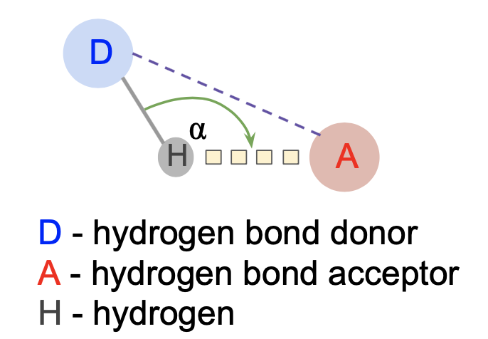


**Geometric rules:**

- |D - A| < 3.9 &#8491;

> **_NOTE:_**
If hydrogens are present in DNA/RNA structure and in ligand, fingeRNAt can be run with flag `-dha`, that additionaly calculates Donor-Hydrogen-Acceptor angle  used as supplementary criteria in hydrogen bonds detection:&nbsp;&nbsp;&nbsp;&nbsp;
  100&deg; <   D-H-A angle < 260&deg; <br/>
  Applies only to `FULL`/`XP` SIFt type, as `SIMPLE` & `PBS` do not calculate hydrogen bonds.


(*Torshin, Weber, & Harrison*, 2002)

In case of `XP` hologram, there is additional assignment of each hydrogen bond type. Depending on Donor - Acceptor distance, each hydrogen bond can be assigned as strong/moderate/weak.

- 2.2 &#8491; < |D - A| < 2.5 &#8491;: strong
- 2.5 &#8491; < |D - A| < 3.5 &#8491;: moderate, mostly electrostatic
- 3.5 &#8491; < |D - A| < 4.0 &#8491;: weak, electrostatic

(*Jeffrey*, 1997)

### 2. Halogen Bonds

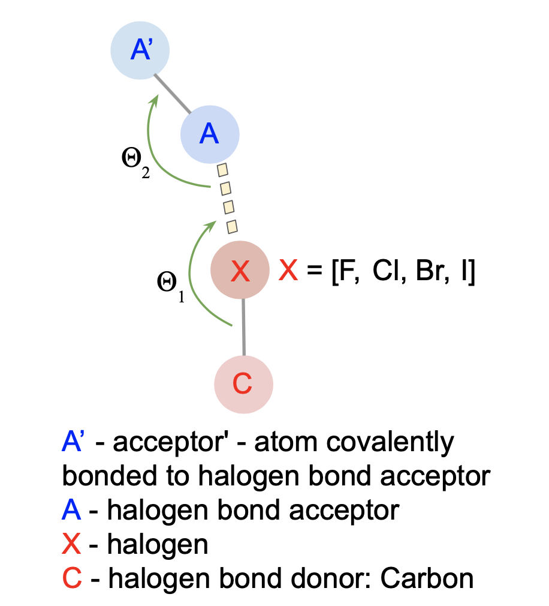


**Geometric rules:**


- |X - O| < 4.0 &#8491;
- C-X-O angle ~ 165&deg; &#177; 30&deg;
- X-O-Y angle ~ 120&deg; &#177; 30&deg;

(*Auffinger et al.*, 2004)

### 3. Cation - Anion

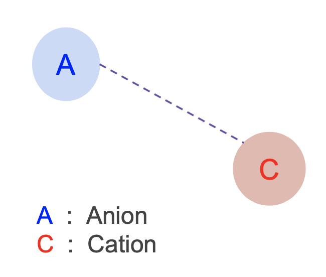


**Geometric rule:**

- 0.5 &#8491; < |cation - anion| < 5.5 &#8491;

(*Barlow and Thornton*, 1983)

    > **_NOTE:_** We consider both oxygens from phosphate group (OP1 and OP2) of DNA/RNA as negatively charged.

### 4. Pi - Cation and 5. Pi - Anion

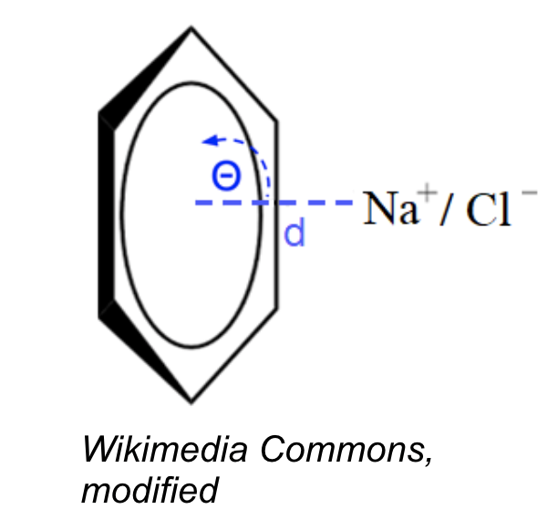


**Geometric rules:**

- |cation/anion - aromatic ring center| < 6.0 &#8491; (*Gallivan and Dougherty*, 1999)
- angle between the ring plane and the line between cation/anion - ring center ~ 90&deg; &#177; 30&deg;

### 6. Pi - Stacking

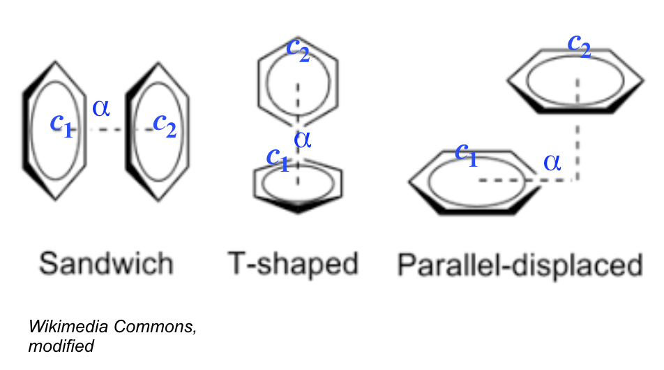


> **_NOTE:_** All above interactions' types are considered by fingeRNAt.

**Geometric rules:**

Common rules for all Pi - stacking interactions' types:

- |rings' centroids| < 5.5 &#8491; (*McGaughey*, 1998)
- rings' outset < 2.0 &#8491;

For Sandwich & Parallel - displaced:
- angle between the ring planes < 30&deg;

For T - shaped:
- angle between the ring planes ~ 90&deg; &#177; 30&deg;


# Contributors


Natalia A. Szulc, @n-szulc


Filip Stefaniak, @filipsPL 

# Feedback

We welcome any feedback, please send an email to Natalia Szulc @n-szulc 


# Acknowledgments

Special thanks of gratitude to [Masoud Farsani](https://github.com/mafarsani), [Pritha Ghosh](https://github.com/prithaghosh) and Tomasz Wirecki for their invaluable feedback as well as to Prof. Janusz M. Bujnicki and the entire [Bujnicki Lab](http://genesilico.pl) for all the support and project guidelines.

Extensive script testing provided by Zuzanna Mackiewicz has been a great help in developing this tool.

Assistance provided by [Open Babel Community](http://openbabel.org) was greatly appreciated.


# How to cite

If you use this software, please cite:

*fingeRNAt - a software for analysis of nucleic acids-ligand complexes. Design and applications.*

Natalia A. Szulc, Zuzanna Mackiewicz, Janusz M. Bujnicki, Filip Stefaniak
[in preparation]

# License

fingeRNAt is licensed under the GNU General Public License v3.0
