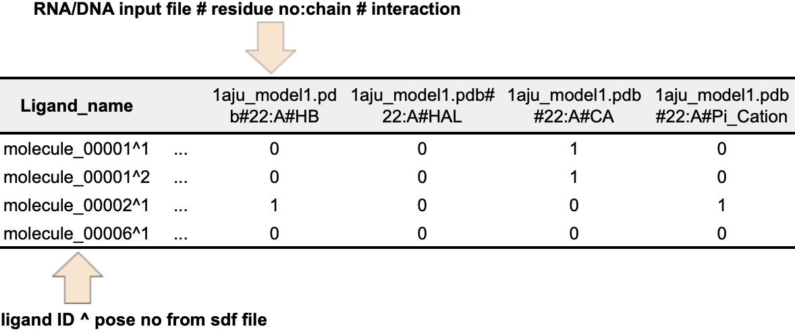
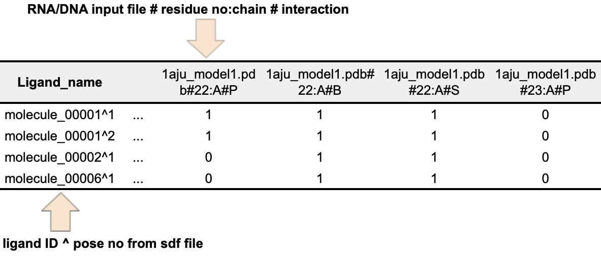
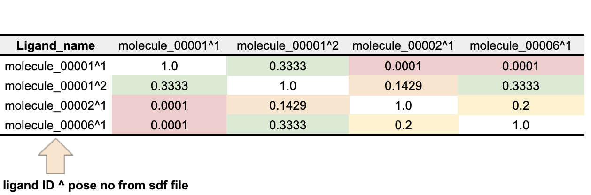

Welcome to fingeRNAt's README
===================

fingeRNAt is a software tool for detecting non-covalent interactions formed within complexes of nucleic acids with ligands.


[](https://www.python.org/downloads/release/python-360/)
[/badge.svg?branch=master)](https://github.com/n-szulc/fingeRNAt/actions?query=workflow%3A%22CI+%28conda%29%22)

[](http://www.repostatus.org/#active)

[](https://www.gnu.org/licenses/gpl-3.0)


<!-- TOC START min:1 max:6 link:true asterisk:false update:true -->
- [Overview](#overview)
	- [What is the Structural Interaction Fingerprint (SIFt)?](#what-is-the-structural-interaction-fingerprint-sift)
	- [What are the Structural Interaction Fingerprint (SIFt) applications?](#what-are-the-structural-interaction-fingerprint-sift-applications)
- [Installation](#installation)
	- [Recommended method](#recommended-method)
	- [Manual installation](#manual-installation)
- [Usage](#usage)
	- [Quick start :zap:](#quick-start-zap)
	- [Parameters description](#parameters-description)
	- [Inputs](#inputs)
	- [Structural Interaction Fingerprint (SIFt) types](#structural-interaction-fingerprint-sift-types)
	- [Interactions with inorganic ions](#interactions-with-inorganic-ions)
	- [User-defined interactions](#user---defined-interactions)
		- [Interaction types](#interaction-types)
		- [YAML template](#yaml-template)
	- [User-defined thresholds](#user---defined-thresholds)
	- [Outputs](#outputs)
		- [`FULL`](#full)
		- [`SIMPLE`](#simple)
		- [`PBS`](#pbs)
	- [Wrappers](#wrappers)
	- [Detail mode](#detail-mode)
	- [PyMOL visualization](#pymol-visualization)
	- [Usage examples](#usage-examples)
	- [Graphical User Interface](#graphical-user-interface)
	- [Debugging mode](#debugging-mode)
	- [Warnings/Errors](#warningserrors)
- [Frequently Asked Questions (FAQ)](#frequently-asked-questions-faq)
- [fingerDISt :straight_ruler:](#fingerdist-straight_ruler)
	- [Installation](#installation-1)
	- [Usage](#usage-1)
		- [Quick start :zap:](#quick-start-zap-1)
		- [Parameters description](#parameters-description-1)
		- [Inputs](#inputs-1)
		- [Distance Metrics](#distance-metrics)
		- [Outputs](#outputs-1)
		- [Usage examples](#usage-examples-1)
- [Documentation](#documentation)
- [Unit test](#unit-test)
- [Detection of interactions](#detection-of-interactions)
	- [Nucleic acid properties](#nucleic-acid-properties)
	- [Ligand properties](#ligand-properties)
	- [Molecular Interactions' Geometric Rules](#molecular-interactions-geometric-rules)
	- [1. Hydrogen bonds](#1-hydrogen-bonds)
	- [2. Halogen bonds](#2-halogen-bonds)
	- [3. Cation - anion interactions](#3-cation---anion-interactions)
	- [4. Pi - cation & 5. Pi - anion interactions](#4-pi---cation--5-pi---anion-interactions)
	- [6. Pi - stacking interactions](#6-pi---stacking-interactions)
	- [7. Ion-mediated interactions](#7-ion-mediated-interactions)
	- [8. Water-mediated interactions](#8-water-mediated-interactions)
	- [9. Lipophilic interactions](#9-lipophilic-interactions)
- [Contributors](#contributors)
- [Feedback](#feedback)
- [Acknowledgments](#acknowledgments)
- [How to cite](#how-to-cite)
- [License](#license)
<!-- TOC END -->

# Overview

fingeRNAt is a a Python 3.8  software tool for detecting non-covalent interactions formed within complexes of nucleic acids with ligands. 

Interactions are encoded and saved i.e. in the form of bioinformatic-friendly **Structural Interaction Fingerprint (SIFt)** - a binary string, where the respective bit in the fingerprint is set to 1 in case of a presence of a particular interaction and to 0 otherwise. This enables **high-throughput analysis** of the interaction data using data analysis techniques.

Interactions can be calculated for the following complexes:

<p align="center">

</p>

fingeRNAt runs under Python 3.5 - 3.8 on Linux, macOS and Windows.

## What is the Structural Interaction Fingerprint (SIFt)?

Structural Interaction Fingerprint (**SIFt**) is a binary string, describing existence (1/0) of specified molecular interactions between all receptor's residues and the ligand (*Deng et al.*, 2004).

<p align="center">

</p>

<br/>
<br/>

<p align="center">

</p>

<br/>

**SIFt** translates information about 3D interactions in the receptor-ligand complex into a string, where the respective bit in the fingerprint is set to 1 in case of detecting particular interaction, and to 0 otherwise.

Therefore, **the interactions are represented in a unified fashion, thus allowing for easy high-throughput computational analysis**, as they provide a full picture of all interactions within the complex.

## What are the Structural Interaction Fingerprint (SIFt) applications?

* Machine Learning
* Clustering
* Comparison of interaction modes

# Installation

Recommended fingeRNAt usage is in conda environment.

## Recommended method

1. Install conda

  Please refer to [conda manual](https://docs.conda.io/projects/conda/en/latest/user-guide/install/index.html) and install conda version with Python 3.x according to your operating system.


2. Download fingeRNAt repository

      Manually - click on the green field `Clone or download`, then `Download ZIP`

      **or**

      Clone it into the desired location [requires [git](https://git-scm.com/downloads) installation]

      `git clone --depth=1 https://github.com/n-szulc/fingernat.git`

3. Restore conda environment

      `conda env create -f fingeRNAt/env/fingeRNAt_env.yml`

## Manual installation

Required dependencies are:

- python 3.8
- openbabel 3.1.1
- numpy  
- pandas
- rdkit
- pyyaml
- tk
- tqdm
- sphinx

# Usage

## Quick start :zap:

To call fingeRNAt with example inputs:

```bash
conda activate fingernat

cd fingeRNAt

python code/fingeRNAt.py -r example_inputs/1aju_model1.pdb -l example_inputs/ligands.sdf
```

## Parameters description

fingeRNAt accepts the following parameters:

`-r` &nbsp;&nbsp;&nbsp;&nbsp;&nbsp;&nbsp;&nbsp;&nbsp;&nbsp;&nbsp;&nbsp;&nbsp;&nbsp;&nbsp;&nbsp;&nbsp;&nbsp;&nbsp;&nbsp;&nbsp;&nbsp;&nbsp;&nbsp; path to RNA/DNA structure; see -> [Inputs](#Inputs)

`[-l]` &nbsp;&nbsp;&nbsp;&nbsp;&nbsp;&nbsp;&nbsp;&nbsp;&nbsp;&nbsp;&nbsp;&nbsp;&nbsp;&nbsp;&nbsp;&nbsp;&nbsp;&nbsp;&nbsp;&nbsp;path to ligands file; see -> [Inputs](#Inputs)

`[-f]` &nbsp;&nbsp;&nbsp;&nbsp;&nbsp;&nbsp;&nbsp;&nbsp;&nbsp;&nbsp;&nbsp;&nbsp;&nbsp;&nbsp;&nbsp;&nbsp;&nbsp;&nbsp;&nbsp; optional Structural Interactions Fingerprint (SIFt) type; see -> [SIFt types](#structural-interaction-fingerprints-sift-types)

 &nbsp;&nbsp;&nbsp;&nbsp;&nbsp;&nbsp;&nbsp;&nbsp;&nbsp;&nbsp;&nbsp;&nbsp;&nbsp;&nbsp;&nbsp;&nbsp;&nbsp;&nbsp;&nbsp;&nbsp;&nbsp;&nbsp;&nbsp;&nbsp;&nbsp;&nbsp;&nbsp;&nbsp;&nbsp;&nbsp;&nbsp; available types are: `FULL` [default], &nbsp;&nbsp;`SIMPLE`, &nbsp;&nbsp;`PBS`

`[-addH]` &nbsp;&nbsp;&nbsp;&nbsp;&nbsp;&nbsp;&nbsp;&nbsp;&nbsp;&nbsp;&nbsp;&nbsp;&nbsp; optional module name to be used to add hydrogens to ligands' structures; see -> [Additional notes](#Inputs)

 &nbsp;&nbsp;&nbsp;&nbsp;&nbsp;&nbsp;&nbsp;&nbsp;&nbsp;&nbsp;&nbsp;&nbsp;&nbsp;&nbsp;&nbsp;&nbsp;&nbsp;&nbsp;&nbsp;&nbsp;&nbsp;&nbsp;&nbsp;&nbsp;&nbsp;&nbsp;&nbsp;&nbsp;&nbsp;&nbsp;&nbsp;  available modules are: `OpenBabel` [default], &nbsp;&nbsp;`RDKit`, &nbsp;&nbsp;`None`  

`[-wrapper]` &nbsp;&nbsp;&nbsp;&nbsp;&nbsp;&nbsp;&nbsp; optional SIFt results wrapper; see -> [Wrappers](#Wrappers)

 &nbsp;&nbsp;&nbsp;&nbsp;&nbsp;&nbsp;&nbsp;&nbsp;&nbsp;&nbsp;&nbsp;&nbsp;&nbsp;&nbsp;&nbsp;&nbsp;&nbsp;&nbsp;&nbsp;&nbsp;&nbsp;&nbsp;&nbsp;&nbsp;&nbsp;&nbsp;&nbsp;&nbsp;&nbsp;&nbsp;&nbsp;   available types are: `ACUG`, &nbsp;&nbsp;`PuPy`, &nbsp;&nbsp;`Counter`

`[-o]` &nbsp;&nbsp;&nbsp;&nbsp;&nbsp;&nbsp;&nbsp;&nbsp;&nbsp;&nbsp;&nbsp;&nbsp;&nbsp;&nbsp;&nbsp;&nbsp;&nbsp;&nbsp;&nbsp; optional path to save output

`[-h2o]` &nbsp;&nbsp;&nbsp;&nbsp;&nbsp;&nbsp;&nbsp;&nbsp;&nbsp;&nbsp;&nbsp;&nbsp;&nbsp;&nbsp;&nbsp; optional detection of water-mediated interactions; applies only to SIFt type `FULL` and its wrappers


&nbsp;&nbsp;&nbsp;&nbsp;&nbsp;&nbsp;&nbsp;&nbsp;&nbsp;&nbsp;&nbsp;&nbsp;&nbsp;&nbsp;&nbsp;&nbsp;&nbsp;&nbsp;&nbsp;&nbsp;&nbsp;&nbsp;&nbsp;&nbsp;&nbsp;&nbsp;&nbsp;&nbsp;&nbsp;&nbsp;&nbsp;   if not passed, all columns containing information about water-mediated interactions are empty (`None`)

`[-dha]` &nbsp;&nbsp;&nbsp;&nbsp;&nbsp;&nbsp;&nbsp;&nbsp;&nbsp;&nbsp;&nbsp;&nbsp;&nbsp;&nbsp;&nbsp; optional Donor-Hydrogen-Acceptor angle calculation when detecting hydrogen bonds; see -> [1. Hydrogen Bonds](#1-hydrogen-bonds)

`[-custom]` &nbsp;&nbsp;&nbsp;&nbsp;&nbsp;&nbsp;&nbsp;&nbsp;&nbsp; path to yaml file with information about additional interactions to be calculated; see -> [User-defined interactions](#User---defined-interactions)

`[-fingerDISt]` &nbsp;&nbsp;fingerDISt metrics to be calculated; if passed fingerDISt will be directly run on the output file; 

&nbsp;&nbsp;&nbsp;&nbsp;&nbsp;&nbsp;&nbsp;&nbsp;&nbsp;&nbsp;&nbsp;&nbsp;&nbsp;&nbsp;&nbsp;&nbsp;&nbsp;&nbsp;&nbsp;&nbsp;&nbsp;&nbsp;&nbsp;&nbsp;&nbsp;&nbsp;&nbsp;&nbsp;&nbsp;&nbsp;&nbsp;  see -> [Usage example][Usage-examples-1]

`[-print]` &nbsp;&nbsp;&nbsp;&nbsp;&nbsp;&nbsp;&nbsp;&nbsp;&nbsp;&nbsp;&nbsp;&nbsp; print detected interactions for each nucleic acid - ligand complex on screen

`[-detail]` &nbsp;&nbsp;&nbsp;&nbsp;&nbsp;&nbsp;&nbsp;&nbsp;&nbsp;&nbsp; generate an additional file with detailed data on detected interactions see -> [PyMOL visualization](#pymol-visualization)


 `[-verbose]` &nbsp;&nbsp;&nbsp;&nbsp;&nbsp;&nbsp;&nbsp;&nbsp; provides additional information about performed calculations at the given moment

 `[-debug]` &nbsp;&nbsp;&nbsp;&nbsp;&nbsp;&nbsp;&nbsp;&nbsp;&nbsp;&nbsp;&nbsp;&nbsp; enters debug mode, see -> [Debbuging mode](#debugging-mode)

 `[-h]` &nbsp;&nbsp;&nbsp;&nbsp;&nbsp;&nbsp;&nbsp;&nbsp;&nbsp;&nbsp;&nbsp;&nbsp;&nbsp;&nbsp;&nbsp;&nbsp;&nbsp;&nbsp;&nbsp;&nbsp; show help message

## Inputs

1. `-r `: path to receptor - RNA/DNA structure
    - supported file type: pdb
    - **only 1 model** of RNA/DNA structure
         - if there are more models, you have to choose only one (e.g. manually delete remaining models)
    - **no ligands**
    - may contain water & ions

   &#x1F534; **Hydrogens need to be added**

2. `-l`: optional path to ligand - small molecule, RNA/DNA/LNA or protein
	- **small molecule ligands**
         - supported file types: sdf
         - possible multiple poses of ligands in one file
    - **RNA/DNA structure**
    	- supported file type: sdf
    	- possible multiple models of RNA/DNA structure
    	- **only** RNA/DNA chains
        	- no water, ions, ligands

   &#x1F535; if `-l` is not specified, fingeRNAt **will find all inorganic ions in the receptor file and treat them as ligands**, see -> [Interactions with inorganic ions](#interactions-with-inorganic-ions).

**Additional notes:**

- In the receptor molecule, charges on the phosphate groups do not need to be assigned (fingeRNAt always treats OP1 and OP2 atoms as negatively charged anions).
- Receptor's residues with less than 4 atoms are not considered in calculations.
- Input ligand molecules should have assigned desired protonation state and formal charges. Please pay attention to sdf ligand files converted from pdbqt/mol2 files, if the *formal charges* are preserved in the sdf files.
- All the missing ligands' hydrogens will be automatically added, unless `-addH None` is passed.
- Ligands with added hydrogens will be saved to a new sdf file (to the same directory as input) with `_OB_addedH` or `_RDKit_addedH` suffix, depending on the selected module for `-addH`; for `-addH None` no new sdf file will be saved, as it does not add hydrogens.

## Structural Interaction Fingerprint (SIFt) types

fingeRNAt allows to calculate the following SIFt types:

- `FULL`

    Calculates **nine non-covalent interactions** for each RNA/DNA residue - ligand  pair:

	* hydrogen bondings (HB)
	* halogen bondings (HAL)
	* cation - anion (CA)
	* Pi - cation (Pi\_Cation)
	* Pi - anion (Pi\_anion)
	* Pi - stacking (Pi\_Stacking) interactions
	* ion-mediated; distinguishes between:
		* Magnessium-mediated (Mg\_mediated)
		* Potassium-mediated (K\_mediated),
		* Sodium-mediated (Na\_mediated),
		* Other ion-mediated (Other\_mediated)
	* water-mediated (Water\_mediated); **only if `-hoh` parameter was passed**; otherwise this interaction is assigned as `None`
	* lipophilic (lipophilic\_mediated)

	&#x1F536;Returns twelve 0/1 values for each residue.
	
> **_NOTE:_** It is possible to calculate more interactions specified by the user; see -> [User-defined interactions](#User---defined-interactions)

- `SIMPLE`

    **Calculates distances** between each RNA/DNA residue and the ligand; returns 1 if the distance does not exceed the declared threshold (default = 4.0 &#8491;), 0 otherwise. Does not take into account distances between hydrogens or hydrogen - heavy atom.

	&#x1F536;Returns one 0/1 value for each residue.

- `PBS`

    Divides each RNA/DNA residue into three groups: **Phosphate, Base, Sugar**. Then, **for each group separately**, calculates distance to the ligand; returns 1 if the distance does not exceed the declared threshold (default = 4.0 &#8491;), 0 otherwise. Does not take into account distances between hydrogens or hydrogen - heavy atom.

	&#x1F536;Returns three 0/1 values for each residue.
    > **_NOTE:_** Only for RNA/DNA with canonical residues.

## Interactions with inorganic ions

It is possible to calculate contacts for nucleic acid - ions.

Ions have to be in the same input pdb file and parameter `-l` should be ommited. fingeRNAt will treat all inorganic ions as ligands and calculate SIFt for each residue - ion pair.

As the aforementioned interactions are detected based on contacts, **only SIFt type SIMPLE or PBS may be calculated**.

**Usage example**

`python code/fingeRNAt.py -r example_inputs/3d2v.pdb -f PBS`

**Sample output**

see -> [3d2v.pdb_IONS_SIMPLE.tsv](example_outputs/3d2v.pdb_IONS_SIMPLE.tsv)

## User-defined interactions

The user may provide additional multiple interactions to be calculated in the form of up to 2 SMARTS ([SMILES arbitrary target specification](https://en.wikipedia.org/wiki/SMILES_arbitrary_target_specification)) for both receptor and ligand, passed in the YAML file (see -> [YAML template](#yaml-template)). 

The interactions will be added as new columns to the standard SIFts outputs (works also with all the wrappers) or as new rows to `-detail` outputs.

> **_NOTE:_** Additional interactions can be calculated only for the fingerprint type `FULL`. 

### Interaction types

**1. Contact between defined atoms**

   Given:

   - 1 SMARTS for the receptor
   - 1 SMARTS for the ligand
   - minimum and maximum distance

   Detects atoms fulfilling SMARTS conditions for the receptor and all ligands, checks if distance between each pair of such atoms is within the provided distance range. If so, the interaction is detected.

**2. Contact between defined atoms and angle**

   Given:
    
   *Variant 1*
   
   - 1 SMARTS for the receptor
   - 2 SMARTS for the ligand
   - minimum and maximum distance
   - minimum and maximum angle
   
   Detects atoms fulfilling SMARTS conditions for the receptor and all ligands. 
   
   Checks if distance between atoms fulfilling receptor's SMARTS and first ligand's SMARTS is within the provided distance range. If so, the angle between the three atoms is calculated. If it's value is within the provided angle range, the interaction is detected.
    
  *Variant 2*
   
   - 2 SMARTS for the receptor
   - 1 SMARTS for the ligand
   - minimum and maximum distance
   - minimum and maximum angle
   
   Detects atoms fulfilling SMARTS conditions for the receptor and all ligands. 
   
   Checks if distance between atoms fulfilling receptor's second SMARTS and ligand's SMARTS is within the provided distance range. If so, the angle between the three atoms is calculated. If it's value is within the provided angle range, the interaction is detected.
   
**3. Contact between defined atoms and two angles**

   Given:
   
   - 2 SMARTS for the receptor
   - 2 SMARTS for the ligand
   - minimum and maximum distance
   - minimum and maximum angle no 1
   - minimum and maximum angle no 2

   Detects atoms fulfilling SMARTS conditions for the receptor and all ligands. 
   
   Checks if distance between atoms fulfilling receptor's second SMARTS and first ligand's SMARTS is within the provided distance range. If so, the angle between the receptor's atom 1 - receptor's atom 2 - ligand's atom 1 is calculated. 
   
   If it's value is within the provided angle no 1 range, the angle between the receptor's atom 2 - ligand's atom 1 - ligand's atom 2 is calculated. If it's value is within the provided angle no 2 range, the interaction is detected.

> **_NOTE:_** If atoms that do not belong to the receptor (e.g. ions/water present in the structure) will be found for any of the receptor's SMARTS, or atoms belonging to receptor's residue with < 4 atoms, they will not be considered. 

> **_NOTE 2:_** In case two SMARTS are given for the receptor/ligand, receptor's atom 1 and receptor's atom 2 (and/or ligand's atom 1 and ligand's atom 2) will be considered only if bound (this will be detected by the fingeRNAt).

### YAML template

Each interaction title will be used as interaction name in the proper column of SIFt outputs or as *Interaction* in `-detail` output.

## User-defined thresholds

All the default thresholds can be changed in `code/config.py`

## Outputs

Outputs are saved to tsv files. Tsv is a simple text format similar to csv, except for the data being tab-separated instead of comma-separated.

If fingeRNAT was run without optional parameter `-o`, script will create `outputs/` directory in the working directory and save there the output in tsv format. Otherwise fingeRNAt will save outputs in the user-specified location.

Example outputs for different SIFt types, their wrappers and `-detail` are available from `fingeRNAt/example_outputs`.

### `FULL`
<br/>

<p align="center">

</p>

Sample extract of output of running `python code/fingeRNAt.py -r example_inputs/1aju_model1.pdb -l example_inputs/ligands.sdf -h2o`

**Sample output**

see -> [1aju_model1.pdb_ligands.sdf_FULL.tsv](example_outputs/1aju_model1.pdb_ligands.sdf_FULL.tsv)

> **_NOTE:_** If fingeRNAt was called without `-h2o` parameter, all columns containing information about water-mediated interactions are empty (`None`) (applies also for wrappers; (see -> ['Parameters description'](#parameters-description))).

with user-defined interactions see ->  

### `SIMPLE`

<p align="center">

</p>

Sample extract of output of running `python code/fingeRNAt.py -r example_inputs/1aju_model1.pdb -l example_inputs/ligands.sdf -f SIMPLE`


<br/>

**Sample output**

see -> [1aju_model1.pdb_ligands.sdf_SIMPLE.tsv](example_outputs/1aju_model1.pdb_ligands.sdf_SIMPLE.tsv)

### `PBS`

<p align="center">

</p>

Sample extract of output of running `python code/fingeRNAt.py -r example_inputs/1aju_model1.pdb -l example_inputs/ligands.sdf -f PBS`

<br/>

**Sample output**

see -> [1aju_model1.pdb_ligands.sdf_PBS.tsv](example_outputs/1aju_model1.pdb_ligands.sdf_PBS.tsv)

## Wrappers

Calculated SIFt (of any type) can be wrapped, which allows for representing it in lower resolution.

The results for the SIFt calculations and all passed wrappers are saved to separate tsv files.
Multiple wrappers may be passed at once (comma-separated; see -> ['Usage examples'](#usage-examples)).

The following three types of wrappers are available:

- `ACUG`

	Wraps calculated results according to nucleotide. Provides information if particular kind of interaction between e.g. any adenine from RNA/DNA and ligand occurred.

	<p align="center">
	
	</p>

	Sample extract of output of running `python code/fingeRNAt.py -r example_inputs/1aju_model1.pdb -l example_inputs/ligands.sdf -f PBS -wrapper ACUG`

	**Sample output**

	see -> [1aju_model1.pdb_ligands.sdf_FULL_ACUG.tsv](example_outputs/1aju_model1.pdb_ligands.sdf_FULL_ACUG.tsv)


- `PuPy`

	Wraps calculated results according to nucleobase type (purine or pyrimidyne). Provides information if particular kind of interaction between e.g. any purine from RNA/DNA and ligand occurred.

	<p align="center">
	
	</p>

	Sample extract of output of running `python code/fingeRNAt.py -r example_inputs/1aju_model1.pdb -l example_inputs/ligands.sdf -wrapper PuPy`

	**Sample output**

	see -> [1aju_model1.pdb_ligands.sdf_FULL_PuPy.tsv](example_outputs/1aju_model1.pdb_ligands.sdf_FULL_PuPy.tsv)

> **_NOTE:_**  As `-h2o` parameter was not passed, the columns containing information about water-mediated interactions are empty (`None`) (see -> ['Parameters description'](#parameters-description)).

- `Counter`

	Counts total number of given interaction type.

	<p align="center">
	
	</p>

	Sample extract of output of running `python code/fingeRNAt.py -r example_inputs/1aju_model1.pdb -l example_inputs/ligands.sdf -wrapper Counter`

	**Sample output**

	see -> [1aju_model1.pdb_ligands.sdf_FULL_Counter.tsv](example_outputs/1aju_model1.pdb_ligands.sdf_FULL_Counter.tsv)

> **_NOTE:_**  As -h2o parameter was not passed, the columns containing information about water-mediated interactions are empty (`None`) (see -> ['Parameters description'](#parameters-description))

## Detail mode

fingeRNAt has additional mode `-detail` which saves all detected interactions, for any SIFt type, to separate tsv file (file with prefix `DETAIL_`).

The interactions saved in `-detail` mode follow the same convention - **each row contains information about interaction between given ligand - receptor**, thus allowing for their easy, high-throughput processing.

The abovementioned data serve also as input to dedicated Pymol plugin, created by us, to visualize all interactions detected by fingeRNAt (see -> [PyMOL visualization](#pymol-visualization)).

> **_NOTE:_** In case of ion- and water-mediated interactions, two rows will correspond to one such interaction: (i) ligand - ion/water molecule and (ii) ion/water molecule - RNA/DNA. Therefore in case (i) ion/water molecule is treated as the receptor and in case (ii) as the ligand.

> **_NOTE 2:_** We refer to ligands as structures from ligands' file `-l`, as water molecules and inorganic ions are supposed to be provided in the RNA/DNA input pdb file.

The following data are saved in `-detail` mode:

* **Ligand_name**
  * for ligands from sdf file: ligand's name
  * for inorganic ions: ion's name
  * for water molecules: HOH
* **Ligand_pose**
  * for ligands from sdf file: ligand's pose number (indexed from 1)
  * for inorganic ions/water molecules: 0
* **Ligand_occurrence_in_sdf**
  * if `-l` ligands' file was passed
    * for ligands from sdf file: ligand's occurrence from the beginning of sdf file
    * for inorganic ions/water molecules: ligand's occurrence (from the beginning of sdf file), for which they mediate the interaction with nucleic acid
  * if `-l` ligands' file was not passed: 0 (see -> [Interactions with inorganic ions](#interactions-with-inorganic-ions))
* **Interaction**: interaction type
* **Ligand_Atom**
  * for ligands from sdf file: ligand's atom index
  * for inorganic ions/water molecules: residue number : chain
* **Ligand_X/Ligand_Y/Ligand_Z**: coordinates of ligand's/ion's/water molecule's atom
* **Receptor_Residue_Name/Receptor_Number/Receptor_Chain**:
  * for interactions ligand/inorganic ions/water molecule - nucleic acid: receptor's nucleotide name/receptor's residue number/receptor's chain
  * for interactions ligand - ion: ion's name/ion's residue number/ion's chain
  * for interactions ligand - water molecule: HOH/water molecule's residue number/water molecule's chain
* **Receptor_Atom**
  * for interactions ligand/inorganic ions/water molecule - nucleic acid: receptor's atom ID
  * for interactions ligand - ion: ion's name
  * for interactions ligand - water molecule: O
* **Receptor_X/Receptor_Y/Receptor_Z**: coordinates of ligand's/ion's/water molecule's atom
* **Distance**: distance between ligand's and residue's atoms [&#8491;]

**Sample output**
see -> [DETAIL_1aju_model1.pdb_ligands.sdf_FULL.tsv](example_outputs/DETAIL_1aju_model1.pdb_ligands.sdf_FULL.tsv)

## PyMOL visualization

Dedicated PyMOL plugin was created to visualize detected interactions based on `-detail` outputs (see -> [Detail mode](#detail-mode)).

## Usage examples

- Calculate SIFt `FULL`, print detected interactions on screen and save the output in the default location with the default filename.

 `python code/fingeRNAt.py -r example_inputs/1aju_model1.pdb -l example_inputs/ligands.sdf -print`

- Calculate SIFt `FULL` with user-defined interactions and table containing details on each detected interaction with the default filenames in the `outputs` directory.

 `python code/fingeRNAt.py -r example_inputs/1aju_model1.pdb -l example_inputs/ligands.sdf -custom example_inputs/custom-interactions.yaml -detail`

- Calculate SIFt `SIMPLE` and save the output in the user-declared location with the default filename.

 `python code/fingeRNAt.py -r example_inputs/1aju_model1.pdb -l example_inputs/ligands.sdf -f SIMPLE -o /path/to/my_output/`

- Calculate SIFt `PBS`, see what is being calculated using verbose mode, and save the output with the default filename in the `outputs/` directory.

 `python code/fingeRNAt.py -r example_inputs/1aju_model1.pdb -l example_inputs/ligands.sdf -f PBS -verbose`

- Calculate default SIFt `FULL` and save it's output along with table containing details on each detected interaction with the default filenames in the `outputs` directory.

 `python code/fingeRNAt.py -r example_inputs/1aju_model1.pdb -l example_inputs/ligands.sdf -detail`

- Calculate default SIFt `FULL`, consider water-mediated interactions, and save it's output and three wrapped outputs with the default filenames in the `outputs` directory.

 `python code/fingeRNAt.py -r example_inputs/1aju_model1.pdb -l example_inputs/ligands.sdf -h2o -wrapper ACUG,PuPy,Counter`

- Calculate SIFt for nucleic acid - inorganic ions from the same pdb input file (see -> [Interactions with inorganic ions](#interactions-with-inorganic-ions))

 `python code/fingeRNAt.py -r example_inputs/3d2v.pdb -f PBS`

- **Bonus:** useful bash command to transpose resulting fingerprint file (rs program needed: `sudo apt install rs` for debian-like systems):

 `cat fingerprint_FULL.tsv | sed -e "s/\t/,/g" | rs -c, -C, -T|sed -e 's/.$//' -e "s/,/\t/g" > fingerprint_FULL-T.tsv`

## Graphical User Interface

To use Graphical User Interface (GUI), simply run

`python code/gui.py`

GUI is user-friendly and has all aforementioned functionalities.

<p align="center">

</p>

## Debugging mode

fingeRNAt has debugging mode in which it prints on screen exhaustive information about detected interactions.

Debugging mode may be used with each SIFt type and provides the following information:

- `FULL`

  Prints the following **properties of each ligand**:
  1. atom indices of hydrogen bonds acceptors & donors
  2. atom indices of halogen bonds donors
  3. atom indices of cations & anions
  4. atom indices of ligand's aromatic rings
  5. IDs of inorganic ions in electrostatic contact with ligand_name_detail
  6. IDs of water molecules in contact with ligand
  7. atom indices of lipophilic atoms
  8. atom indices for each user defined-interactions (single atoms if 1 SMARTS for ligand and tuples if 2 SMARTS for ligand were passed)

  Prints the following **properties for each residue** of nucleic acid:
  1. atom IDs of hydrogen bonds acceptors & donors
  2. atom IDs of anions
  3. atom IDs of aromatic rings
  4. atom IDs for each user defined-interactions (single atoms if 1 SMARTS for receptor and tuples if 2 SMARTS for receptor were passed)

  Prints **detected interactions** for pair of each nucleic acid residue - ligand:
  1. atoms creating hydrogen bond with their distance and angle (if parameter `-dha` was passed), separately for cases when nucleic acid is hydrogen bond acceptor and hydrogen bond donor
  2. atoms creating halogen bond with their distance and angles
  3. atoms creating cation-anion interaction with their distance (note that nucleic acid's atoms are anions)
  4. atoms creating Pi-cation interaction with their distance and angle
  5. atoms creating Pi-anion interaction with their distance and angle (note that ligand's atoms are anions)
  6. atoms creating anion-Pi interaction with their distance and angle (note that nucleic acid's atoms are anions)
  7. atoms creating Pi-stacking interaction type Sandwich/Displaced with their distance, offset and angle
  8. atoms creating Pi-stacking interaction type T-shaped with their distance, offset and angle
  9. atoms creating ion-mediated interaction with their distances (nucleic acid - ion & ion - ligand)
  10. atoms creating water-mediated interaction with their distances (nucleic acid - water & water - ligand)
  11. atoms creating lipophilic interaction with their distance
  12. atoms creating each user-defined interaction with their distance and/or angle(s)

- `SIMPLE`

    For each detected contact of nucleic acid residue - ligand prints information about atoms IDs and the distance between them.

- `PBS`

    For each detected contact of nucleic acid residue's group - ligand prints information about atoms IDs and the distance between them.

> **_NOTE:_** In all above cases, only the first detected interaction of given type is printed, as fingeRNAt stops searching for more once it detected one particular interaction.

## Warnings/Errors

Please pay attention to the following types of errors: **Could not sanitize molecule ending on line ...**. This means that RDKit library used by the fingeRNAt cannot properly read the molecule.

e.g.

```
[08:46:45] non-ring atom 39 marked aromatic
[08:46:45] ERROR: Could not sanitize molecule ending on line 168
[08:46:45] ERROR: non-ring atom 39 marked aromatic
```

- Error: **non-ring atom ... marked aromatic**
  - Solution: please make sure that the mentioned molecule has a proper aromatic ring representation.
- Error: **Explicit valence for atom # ..., is greater than permitted** (eg., *Explicit valence for atom # 18 O, 3, is greater than permitted*)
  - Solution: please make sure that the indicated atom(s) have a proper valence number, i.e., they form a correct number of bonds.

# Frequently Asked Questions (FAQ)

**What happens when I have a non-canonical nucleotide in my nucleic acid?**

* If you have a residue with **only** non-canonical name (all atom names are canonical), e.g. X

|   | `FULL`  | `SIMPLE`  | `PBS`  |
|:-:|:-:|:-:|:-:|
| No wrapper  |  OK |  OK  | OK   |
| `ACUG`  | Omits interaction for residue with non-canonical name  | Omits interaction for residue with non-canonical name  |  Omits interaction for residue with non-canonical name |
|  `PuPy` |  Omits interaction for residue with non-canonical name | Omits interaction for residue with non-canonical name  |  Omits interaction for residue with non-canonical name |
| `Counter`  |  OK |  OK | OK  |

* If you have a residue with a canonical name but with non-canonical atom name e.g. P9

|   | `FULL`  | `SIMPLE`  | `PBS`  |
|:-:|:-:|:-:|:-:|
| No wrapper  |  OK |  OK  | Does not work   |
| `ACUG`  |  OK   | OK  |  Does not work|
|  `PuPy` |   OK  | OK |  Does not work|
| `Counter`  |  OK |  OK | Does not work  |

> **_NOTE:_** We consider both oxygens from phosphate group (OP1 and OP2) of nucleic acid as negatively charged, therefore fingeRNAt will not consider differently named atoms as anions.

* If you have a residue with non-canonical name and non-canonical atom name e.g. P9

|   | `FULL`  | `SIMPLE`  | `PBS`  |
|:-:|:-:|:-:|:-:|
| No wrapper  |  OK |  OK  | Does not work   |
| `ACUG`  |  Omits interaction for residue with non-canonical name | Omits interaction for residue with non-canonical name  |  Does not work |
|  `PuPy` | Omits interaction for residue with non-canonical name  | Omits interaction for residue with non-canonical name  |  Does not work |
| `Counter`  |  OK |  OK | Does not work |

> **_NOTE:_** We consider both oxygens from phosphate group (OP1 and OP2) of nucleic acid as negatively charged, therefore fingeRNAt will not consider differently named atoms as anions.

---

**What happens when I have nucleic acid with two residues with the same number e.g. due to errors in structure?**

In case of SIFt types `SIMPLE` and `PBS`, the only difference is that their outputs will have two columns with the same name in output. SIFt and the wrapped results are correct.

However in case of SIFt type `FULL`, there will be two columns with the same name but their Pi-interactions may be swapped and their SIFt as well as the wrapped results may be unreliable.

# fingerDISt :straight_ruler:


fingerDISt is an additional, standalone tool which calculates different Distance Metrics based on Structural Interaction Fingerprint (SIFt) - outputs of fingeRNAt.

It calculates the selected Distance Metric for all SIFt vs. all SIFt from input file - creates a matrix of scores and saves it to tsv file.

## Installation

fingerDISt, similarly like fingeRNAt, requires Python 3.5 - 3.8, and may be run from within fingeRNAt's environment, but it is not obligatory. No external modules are needed.

## Usage

### Quick start :zap:

```bash
cd fingeRNAt

python code/fingerDISt.py -i example_outputs/FULL/1aju_model1.pdb_ligands.sdf_FULL.tsv -m tanimoto
```

### Parameters description

fingerDISt accepts the following parameters:

`-i` &nbsp;&nbsp;&nbsp;&nbsp;&nbsp;&nbsp;&nbsp;&nbsp;&nbsp;&nbsp;&nbsp;&nbsp;&nbsp;&nbsp;&nbsp;&nbsp;&nbsp;&nbsp;&nbsp;&nbsp; path to tsv/csv file with calculated SIFt; see -> [Inputs](#Inputs-1)

`-m` &nbsp;&nbsp;&nbsp;&nbsp;&nbsp;&nbsp;&nbsp;&nbsp;&nbsp;&nbsp;&nbsp;&nbsp;&nbsp;&nbsp;&nbsp;&nbsp;&nbsp;&nbsp;&nbsp;&nbsp; types of desired Distance Metrics; see -> [Distance Metrics](#distance-metrics)

`[-o]` &nbsp;&nbsp;&nbsp;&nbsp;&nbsp;&nbsp;&nbsp;&nbsp;&nbsp;&nbsp;&nbsp;&nbsp;&nbsp;&nbsp;&nbsp;&nbsp; optional path to save output

`[-verbose]` &nbsp;&nbsp;&nbsp;&nbsp; prints calculated Distance Metrics on the screen

`[-h]` &nbsp;&nbsp;&nbsp;&nbsp;&nbsp;&nbsp;&nbsp;&nbsp;&nbsp;&nbsp;&nbsp;&nbsp;&nbsp;&nbsp;&nbsp;&nbsp; show help message

### Inputs

1. `-i `: path to tsv/csv file with calculated SIFs

  **fingeRNAt outputs are fingerDISt inputs**

  Example inputs may be found in `fingeRNAt/tests/expected_outputs`.

### Distance Metrics

fingerDISt calculates the following Distance Metrics:

* Tanimoto coefficient
* Cosine similarity
* Manhattan
* Euclidean
* Square Euclidean
* Half Square Euclidean
* Soergel
* Tversky

Some of a Distance Metrics calculations were implemented based on code [github.com/varun-parthasarathy/crux-fr-sprint/blob/master/DistanceMetrics.py](github.com/varun-parthasarathy/crux-fr-sprint/blob/master/DistanceMetrics.py) under MIT license.

> **_NOTE:_** **Tanimoto coefficient works only for SIFt with binary values**, therefore it may not work on input SIFt wrapped with `Counter` wrapper.


> **_NOTE 2:_** It automatically replaces `None` with 0, meaning that Distance Metrics can be calculated for SIFt type `FULL`, which was called without `-h2o` parameter.

> **_NOTE 3:_**. **Tversky coefficient** is not symmetric. By default, in the resulting matrix, the reference molecules are in columns, while compared molecules in rows. Also it has a hard-coded α and β coefficients with a widely used values of α=1 and β=0 (eg., see: Leung et al. "SuCOS is Better than RMSD for Evaluating Fragment Elaboration and Docking Poses"). To modify this behaviour or coefficient values, please modify the function `tversky(self, p_vec, q_vec)` in the `code/DistanceMetrics.py` module.

### Outputs

fingerDISt saves scores for each selected Distance Metric to separate tsv files - a simple text format similar to csv, except for the data being tab-separated instead of comma-separated.

If fingerDISt was run without optional parameter `-o`, script will create `outputs/` directory in the working directory and save there the output in tsv format. Otherwise fingerDISt will save outputs in the user-specified location.

<p align="center">

</p>

Sample output of running `python code/fingerDISt.py -i tests/expected_outputs/1aju_model1.pdb_ligands.sdf_FULL.tsv -m tanimoto`

### Usage examples

- Calculate all available Distance Metrics on SIFts inputs type `FULL` and save the output with the default filename in the `outputs` directory.

`python code/fingerDISt.py -i tests/expected_outputs/1aju_model1.pdb_ligands.sdf_FULL.tsv -m manhattan,square_euclidean,euclidean,half_square_euclidean,cosine_similarity,tanimoto,soergel,tversky`

- Calculate two Distance Metrics on SIFts inputs type `PBS` wrapped with `ACUG` wrapper and save the output to user-specified location with the default filename.

`python code/fingerDISt.py -i tests/expected_outputs/1aju_model1.pdb_ligands.sdf_PBS_ACUG.tsv -m manhattan,square_euclidean -o my_dir/`

- Calculate one Distance Metric on SIFts inputs type `SIMPLE`, print it on the screen and save the output to the user-specified location.

`python code/fingerDISt.py -i tests/expected_outputs/1aju_model1.pdb_ligands.sdf_SIMPLE.tsv -m tanimoto -verbose -o my_dir/my_filename/`

- Call fingerDISt directly from the fingeRNAt (will calculate the passed Distance Metrics on the calculated SIFts output (however not any wrapped one) and save the result in the same location).

`python code/fingeRNAt.py -r example_inputs/1aju_model1.pdb -l example_inputs/ligands.sdf -fingerDISt tanimoto,tversky`

# Documentation

To generate fingeRNAt documentation file using sphinx:

```bash
cd docs
make html
```

The documentation will be available from `_build/html`.

# Unit test

To run a unit test:

```bash
cd tests
python fingeRNAt_test.py
```

# Detection of interactions

Inspired by [PLIP](https://github.com/pharmai/plip) implementation. Applies to SIFt type `FULL`.

## Nucleic acid properties

The nucleic acid's detected properties are as follows:

* Hydrogen Bonds Acceptors & Donors - detected with OpenBabel
* Halogen Bonds Acceptors - detected with OpenBabel (same as Hydrogen Bonds Acceptors)
* Negative charges - assigned to *both* oxygens (OP1 & OP2) of each residue's phosphate group
* Aromatic rings -  detected with OpenBabel

## Ligand properties

The ligand's detected properties are as follows:

* Hydrogen Bonds Acceptors & Donors - detected with OpenBabel
* Halogen Bonds Donors - detected with OpenBabel
* Positive & Negative charges - detected with OpenBabel
* Aromatic rings - detected with RDKit
* Lipophilic atoms - detected with RDKit

## Molecular Interactions' Geometric Rules

fingeRNAt detects the following nine non-covalent interactions:


## 1. Hydrogen bonds

  Geometric rule:
  - |D - A| < 3.9 &#8491;
	(*Torshin, Weber, & Harrison*, 2002)


  > **_NOTE:_** If hydrogens are present in RNA/DNA structure, fingeRNAt can be run with parameter `-dha`, that additionaly calculates Donor-Hydrogen-Acceptor angle  used as supplementary criteria in hydrogen bonds detection:&nbsp;&nbsp;&nbsp;&nbsp;
  100&deg; <   D-H-A angle < 260&deg; <br/>
  Parameter `-dha` applies only to `FULL` SIFt type, as `SIMPLE` & `PBS` do not calculate hydrogen bonds.

## 2. Halogen bonds

  Geometric rules:

  - |X - A| < 4.0 &#8491;
  (*Auffinger et al.*, 2004)
  - C-X-A angle ~ 165&deg; &#177; 30&deg;
  (*Auffinger et al.*, 2004)
  - X-A-A' angle ~ 120&deg; &#177; 30&deg;
  (*Auffinger et al.*, 2004)

## 3. Cation - anion interactions

  Geometric rule:

  - 0.5 &#8491; < |cation - anion| < 5.5 &#8491;
  (*Barlow and Thornton*, 1983)

  > **_NOTE:_** fingeRNAt considers both oxygens from phosphate group (OP1 and OP2) of RNA/DNA as negatively charged.

## 4. Pi - cation & 5. Pi - anion interactions

  Geometric rules:

  - |cation/anion - aromatic ring center| < 6.0 &#8491;
  (*Gallivan and Dougherty*, 1999)
  - angle between the ring plane and the line between cation/anion - ring center ~ 90&deg; &#177; 30&deg;

 > **_NOTE:_** In case of Pi - cation interaction, aromatic ring is only from the nucleic acid side (as nucleic acids are negatively charged). However, Pi - anion interaction is considered both ways: (i) nucleic acid's aromatic ring - ligands's anion and (ii) nucleic acid's anion (from phosphate group; see above) - ligand's aromatic ring.

## 6. Pi - stacking interactions

  Geometric rules:

  * Common rules for all Pi - stacking interactions' types:

    * |rings' centroids| < 5.5 &#8491;
    (*McGaughey*, 1998)
    * rings' outset < 2.0 &#8491;

  * For sandwich & parallel - displaced:
    * angle between the ring planes < 30&deg;

  * For T - shaped:
    * angle between the ring planes ~ 90&deg; &#177; 30&deg;

> **_NOTE:_** fingeRNAt considers all three abovementioned Pi - stacking interactions' types.

##  7. Ion-mediated interactions

  Geometric rules:

  * |ligand's nitrogen/oxygen/sulphur - ion| <= X
  * |nucleic acid's nitrogen/oxygen - ion| <= X, where:
    * X = 3.2 &#8491; for magnesium ion (*Zheng et al.*, 2015)
    * X = 3.9 &#8491; for potassium ion (*Zheng et al.*, 2008)
    * X = 3.6 &#8491; for sodium ion (*Zheng et al.*, 2008)
    * X = 3.5 &#8491; for other ions (*Zheng et al.*, 2008)

## 8. Water-mediated interactions

> **_NOTE:_**  Only if fingeRNAt was called with `-h2o` parameter.

  Geometric rules:
  * |ligand's hydrogen bond donor/acceptor - water (oxygen)| <= 3.5 &#8491;
	(*Poornima & Dean*, 1995)
  * |nucleic acid's hydrogen bond donor/acceptor - water (oxygen)| <= 3.5 &#8491;
	(*Poornima & Dean*, 1995)

## 9. Lipophilic interactions

  Geometric rule:
  * |nucleic acid's carbon - ligand's lipophilic atom| <= 4.0 &#8491;
	(*Padroni et al.*, 2020)

# Contributors

Natalia Szulc, @n-szulc 

Filip Stefaniak, @filipsPL 

# Feedback

We welcome any feedback, please send an email to Natalia Szulc  


# Acknowledgments

Special thanks of gratitude to [Masoud Farsani](https://github.com/mafarsani), [Pritha Ghosh](https://github.com/prithaghosh) and Tomasz Wirecki for their invaluable feedback as well as to Prof. Janusz M. Bujnicki and the entire [Bujnicki Lab](http://genesilico.pl) for all the support and project guidelines.

Extensive script testing provided by Zuzanna Mackiewicz has been a great help in developing this tool.

Assistance provided by [Open Babel Community](http://openbabel.org) was greatly appreciated.


# How to cite

If you use this software, please cite:

*fingeRNAt - a novel tool for high-throughput analysis of nucleic acid-ligand interactions*

Natalia A. Szulc, Zuzanna Mackiewicz, Janusz M. Bujnicki, Filip Stefaniak
[in preparation]

# License

fingeRNAt is licensed under the GNU General Public License v3.0.
